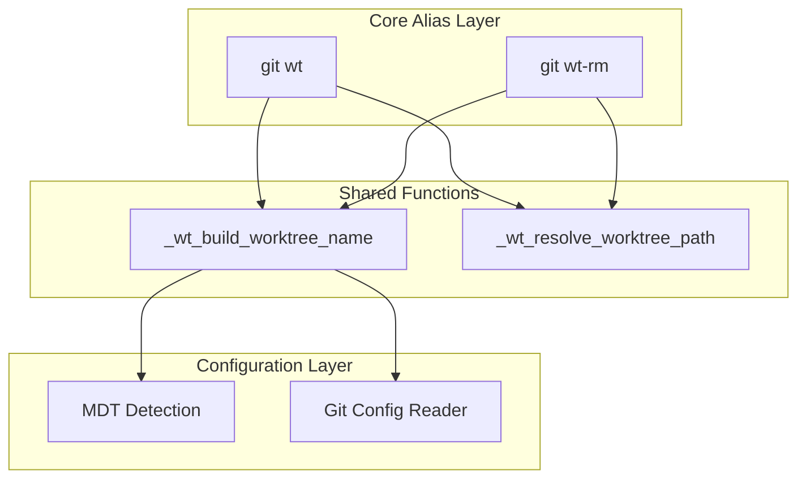

# Architecture: WTA-002

**Source**: [WTA-002](../WTA-002-decouple-mdt-integration-from-core-worktree-alias-.md)
**Generated**: 2025-12-23
**Complexity Score**: 7

## Overview

Decouple MDT integration from core worktree alias logic by introducing a **generic configuration model** for ticket formatting. Instead of building specific adapters for Jira, GitHub, etc., the system provides configurable formatting rules (prefix, zero-padding) that work for any ticket system. MDT projects retain auto-detection behavior, while non-MDT projects use simple git config settings.

## Pattern

**Configuration-Driven Formatting** — Generic settings define how to transform input into worktree/branch names. No ticket-system-specific code required.

## Key Decisions

### Decision 1: Generic Configuration vs. Specific Adapters

**Chosen**: Generic configuration via git config

**Rationale**:
- Specific adapters (JiraProvider, GitHubProvider) create maintenance burden
- Generic settings (prefix + padding) cover 95% of use cases
- Users can extend with custom scripts if needed (git hooks, shell functions)

**Trade-off**: Less "magic" auto-detection, but more flexibility and simplicity

### Decision 2: Prefix Applies to Numbers Only

**Chosen**: Prefix is added only when input is a pure number

**Rationale**:
- `git wt 12` with `ticketPrefix=ABC-` → `ABC-12` (ticket)
- `git wt feature-auth` with `ticketPrefix=ABC-` → `feature-auth` (branch name)
- Separates "ticket with prefix" from "arbitrary branch name"

### Decision 3: Input Can Be Anything

**Chosen**: No validation that input must be numeric

**Rationale**:
- Users may want `git wt feature-login` without ticket numbers
- Already-prefixed inputs (`PROJ-123`) should pass through unchanged
- System is a worktree helper, not a ticket validator

## Configuration Model

### Settings (via git config)

All settings are namespaced under `worktree.wt.*`:

| Setting | Purpose | Example | Default |
|---------|---------|---------|---------|
| `worktree.wt.prefix` | Prefix added to numeric inputs | `"ABC-"`, `"#"` | (none) |
| `worktree.wt.zeroPadDigits` | Zero-pad numbers to N digits | `3` → `001` | (none) |
| `worktree.wt.defaultPath` | Path template for worktree creation | `".gitWT/{worktree_name}"` | (none) |

### MDT Auto-Detection

When `.mdt-config.toml` exists in repo root:
- Read `code` field (e.g., `code = "WTA"`)
- Auto-set `ticketPrefix` to `{code}-`
- Auto-set `zeroPadDigits` to `3`
- User can override with git config (takes precedence)

## Input Processing Logic

```
                    ┌─────────────────────┐
                    │   User Input        │
                    └──────────┬──────────┘
                               │
                               ▼
                    ┌─────────────────────┐
                    │ Already prefixed?   │
                    │ (e.g., PROJ-123)    │
                    └──────────┬──────────┘
                     Yes              │ No
                       │              ▼
                       │     ┌─────────────────────┐
                       │     │ Is pure number?     │
                       │     └──────────┬──────────┘
                       │      Yes              │ No (text)
                       │        │              │
                       │        ▼              ▼
                       │  ┌──────────┐   ┌──────────┐
                       │  │ MDT mode?│   │ Pass     │
                       │  │ or       │   │ through  │
                       │  │ generic  │   │ unchanged│
                       │  │ config   │   └──────────┘
                       │  └────┬─────┘
                       │       │
                       │       ▼
                       │  ┌─────────────────────┐
                       │  │ Apply zero-padding  │
                       │  │ (if configured)     │
                       │  └──────────┬──────────┘
                       │             │
                       │             ▼
                       │  ┌─────────────────────┐
                       │  │ Add ticketPrefix     │
                       │  │ (if configured)      │
                       │  └──────────┬──────────┘
                       │             │
                       └─────────────┴─────────────┘
                                     │
                                     ▼
                          ┌─────────────────────┐
                          │ Final worktree name │
                          └─────────────────────┘
```

## Example Behaviors

| Input | prefix | zeroPadDigits | Result | Mode |
|-------|--------|---------------|--------|------|
| `101` | none | none | `101` | Generic |
| `101` | `ABC-` | none | `ABC-101` | Generic |
| `1` | `ABC-` | `3` | `ABC-001` | Generic |
| `12` | `#` | `3` | `#012` | Generic |
| `feature-auth` | `ABC-` | any | `feature-auth` | Generic (text, no prefix) |
| `PROJ-123` | any | any | `PROJ-123` | Already prefixed |
| `12` | (MDT auto) | (MDT auto=3) | `WTA-012` | MDT (code=WTA) |

## Component Boundaries



| Component | Responsibility | Owns | Depends On |
|-----------|----------------|------|------------|
| `git wt` | Worktree creation orchestration | Path templating, git commands, error handling | `_wt_build_worktree_name`, `_wt_resolve_worktree_path` |
| `git wt-rm` | Worktree removal orchestration | Path resolution, confirmation, cleanup | `_wt_build_worktree_name`, `_wt_resolve_worktree_path` |
| `_wt_build_worktree_name` | Input → worktree name transformation | Prefix logic, zero-padding, MDT detection | Git config system (`worktree.wt.*`), `.mdt-config.toml` |
| `_wt_resolve_worktree_path` | Path template → absolute path | Placeholder expansion, tilde expansion, relative/absolute handling | `worktree.wt.defaultPath` config |

## Shared Patterns

| Pattern | Occurrences | Extract To |
|---------|-------------|------------|
| Worktree name building | Lines 16-31 (wt), Lines 143-158 (wt-rm) | `_wt_build_worktree_name()` |
| Path template resolution | Lines 77-92 (wt), Lines 172-184 (wt-rm) | `_wt_resolve_worktree_path()` |

> Phase 1 extracts these BEFORE refactoring wt/wt-rm to use them.

## Structure

```
install_aliases.sh
  ├── _wt_build_worktree_name()        → Input transformation (limit 50 lines)
  ├── _wt_resolve_worktree_path()      → Path resolution (limit 40 lines)
  ├── git wt (alias)                   → Worktree creation (limit 70 lines)
  └── git wt-rm (alias)                → Worktree removal (limit 80 lines)
```

**Note**: File renamed from `git_config_alias_worktree.sh` to `install_aliases.sh`

## Size Guidance

| Module | Role | Limit | Hard Max |
|--------|------|-------|----------|
| `_wt_build_worktree_name` | Input transformation (prefix, padding, MDT detection) | 50 | 75 |
| `_wt_resolve_worktree_path` | Path template resolution | 40 | 60 |
| `git wt` | Worktree creation orchestration | 70 | 105 |
| `git wt-rm` | Worktree removal orchestration | 80 | 120 |

**Current totals**: wt (~126 lines), wt-rm (~115 lines)
**Target totals**: wt (~70 lines), wt-rm (~80 lines), shared (~90 lines)

## Error Scenarios

| Scenario | Detection | Response | Recovery |
|----------|-----------|----------|----------|
| `.mdt-config.toml` malformed | File exists but `code` field missing/invalid | Fall back to git config, then default | Use input as-is with warning |
| Git config unreadable | Permission issues or corrupted config | Fall back to default (no prefix) | Normal execution continues |

## Refactoring Plan

### Transformation Matrix

| Component | From | To | Reduction | Reason |
|-----------|------|----|-----------|--------|
| Worktree name resolution | Lines 16-31 (wt), Lines 143-158 (wt-rm) | `_wt_build_worktree_name()` | 32→50 lines (shared) | Consolidate MDT + generic logic |
| Path template resolution | Lines 77-92 (wt), Lines 172-184 (wt-rm) | `_wt_resolve_worktree_path()` | 32→40 lines (shared) | Eliminate duplication |
| Core wt logic | Lines 1-126 | Lines 1-70 | ~56 line reduction | Extracted to shared functions |
| Core wt-rm logic | Lines 128-243 | Lines 1-80 | ~35 line reduction | Extracted to shared functions |

**Net impact**: ~64 lines duplicated → ~90 lines shared (better organization, single source of truth)

### Interface Preservation

| Public Interface | Status | Verification |
|------------------|--------|--------------|
| `git wt <ticket>` | Preserved | Existing tests cover behavior |
| `git wt-rm <ticket>` | Preserved | Existing tests cover behavior |
| `worktree.defaultPath` config | **Renamed** to `worktree.wt.defaultPath` | **Breaking change**: users must migrate |
| `.mdt-config.toml` integration | Preserved | Existing tests cover behavior |
| **New**: `worktree.wt.prefix` config | **Added** | New tests needed |
| **New**: `worktree.wt.zeroPadDigits` config | **Added** | New tests needed |

### Migration Required

**Breaking change**: Existing `worktree.defaultPath` configurations must be migrated to `worktree.wt.defaultPath`.

**Migration command** (run before upgrading):
```bash
# For each repo/worktree where you have worktree.defaultPath configured:
old_path=$(git config worktree.defaultPath)
git config worktree.wt.defaultPath "$old_path"
git config --unset worktree.defaultPath
```

**Global migration** (if set globally):
```bash
old_path=$(git config --global worktree.defaultPath)
git config --global worktree.wt.defaultPath "$old_path"
git config --global --unset worktree.defaultPath
```

**Detection** (find repos that need migration):
```bash
# Check if old config exists
git config worktree.defaultPath
```

### Behavioral Equivalence

- Test suite: `test/wt_*.bats` — existing tests verify MDT behavior preserved
- New tests needed: Generic mode (ticketPrefix, zeroPadDigits)
- Performance: No measurable impact (function call overhead negligible)
- Migration: No migration steps needed (backward compatible, new settings are opt-in)

## Requirement Coverage

| Requirement | Component | Notes |
|-------------|-----------|-------|
| AC1: `git wt 101` without `.mdt-config.toml` | `_wt_build_worktree_name()` → generic mode | No config, uses "101" as-is |
| AC2: `git wt PROJ-123` without file | Input detection | Already prefixed, passes through unchanged |
| AC3: Auto-prefix with `.mdt-config.toml` | MDT detection in `_wt_build_worktree_name()` | Reads code, auto zero-pads to 3 digits |
| AC4: Git config alternative | Generic mode in `_wt_build_worktree_name()` | Reads `worktree.wt.prefix`, `worktree.wt.zeroPadDigits` |
| AC5: Extensible without core changes | Generic configuration model | Add any prefix/padding combo via git config |

**Coverage**: 5/5 requirements mapped (100%)

## Configuration Examples

### GitHub-style (hash prefix)
```bash
git config worktree.wt.prefix "#"
git wt 42       # Creates branch: #42
```

### JIRA-style (project key + zero-padding)
```bash
git config worktree.wt.prefix "ASD22-"
git config worktree.wt.zeroPadDigits 4
git wt 7        # Creates branch: ASD22-0007
```

### No prefix (bare numbers)
```bash
# No config needed
git wt 123      # Creates branch: 123
```

### Feature branches (text input)
```bash
git config worktree.wt.prefix "feat-"
git wt login    # Creates branch: login (text, prefix ignored)
git wt 101      # Creates branch: feat-101 (number, prefix applied)
```

### MDT project (auto-detected)
```bash
# .mdt-config.toml contains: code = "WTA"
git wt 12       # Creates branch: WTA-012 (auto prefix + zero-padding)
```

## Extension Rule

No code changes needed for extensibility:

1. **New prefix style**: Set `worktree.wt.prefix` via git config
2. **Different padding**: Set `worktree.wt.zeroPadDigits` via git config
3. **Custom behavior**: Use git aliases or shell functions to wrap `git wt`

Example wrapper for team-specific workflow:
```bash
# In ~/.gitconfig or local .git/config
[alias]
    feature = "!f() { git wt \"feature-$1\"; }; f"
    bug = "!f() { git wt \"bug-$1\"; }; f"

# Usage
git feature login    # Creates branch: feature-login
git bug 123          # Creates branch: bug-123
```

---
*Generated by /mdt:architecture*
