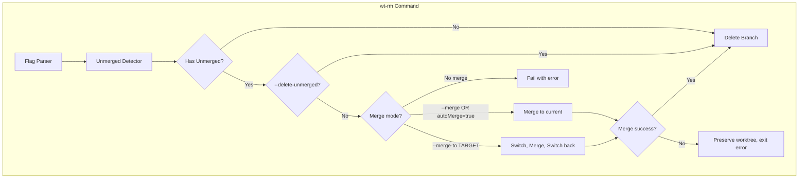
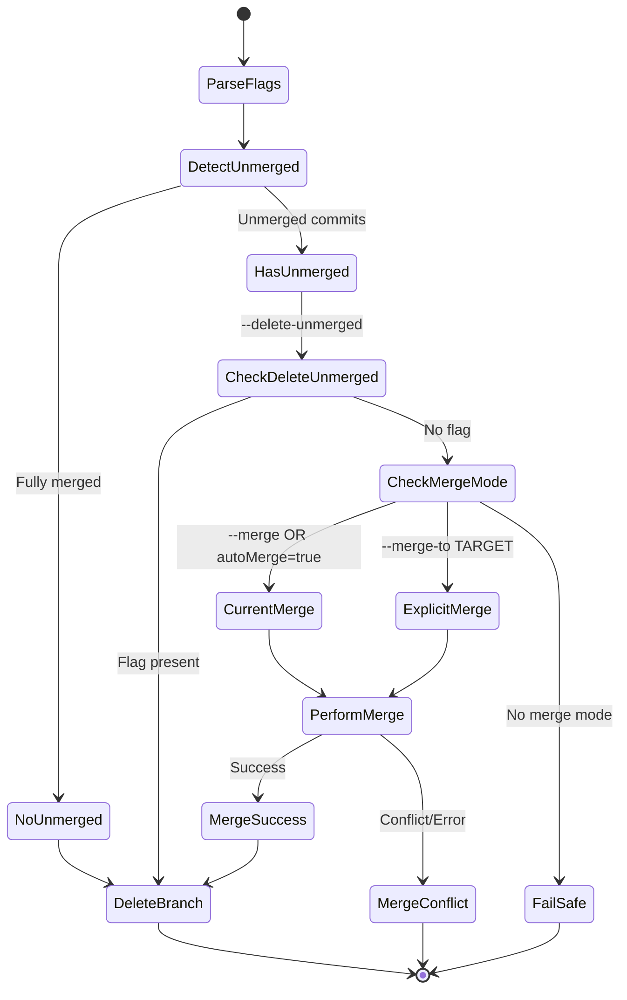

# Architecture: WTA-003

**Source**: [WTA-003](./WTA-003.md)
**Generated**: 2025-12-24
**Complexity Score**: 9

## Overview

This architecture extends `git wt-rm` with merge capabilities and branch protection. The design adds flag parsing, unmerged detection, merge execution, and automated workflows while preserving existing `WT_TEST_RESPONSE` testing support and backward compatibility.

Key constraints:
- `--merge` merges into current branch (no checkout needed)
- `--merge-to TARGET` switches to TARGET, merges, switches back
- `autoMerge` config enables same behavior as `--merge` flag
- Must preserve worktree/branch on merge failure (Git default behavior)
- Must support automation via `--quiet` and `WT_TEST_RESPONSE`
- Must provide opt-in via `worktree.wt.autoMerge = true` config (default: false)

## Pattern

**Command Workflow with Flag Modulation** — The command behavior changes based on flag combinations. Merge is opt-in via `--merge`, `--merge-to TARGET`, or `worktree.wt.autoMerge = true` config.

This pattern allows:
- Safe default (fail-safe when unmerged, prevents data loss)
- User control (`--merge` for current branch, `--merge-to TARGET` for explicit)
- Power user override (`--delete-unmerged` for intentional discarding)
- Automation support (`--quiet` for CI/CD, `autoMerge` for default behavior)

## Key Dependencies

**Build Custom Decisions**:
| Capability | Reason | Estimated Size |
|------------|--------|---------------|
| Flag parsing | Simple needs (3 flags), avoid external dependencies in bash alias | ~30 lines |
| Unmerged detection | `git branch --merged` check is one-liner | ~5 lines |
| Merge orchestration | Need to switch branches, merge, switch back | ~40 lines |

No external dependencies — all Git commands and bash built-ins.

## Component Boundaries



| Component | Responsibility | Owns | Depends On |
|-----------|----------------|------|------------|
| `Flag Parser` | Parse `--merge`, `--merge-to`, `--delete-unmerged`, `--quiet` flags | Flag state variables | Bash argument parsing |
| `Unmerged Detector` | Check if branch has unmerged commits | Boolean state | `git branch --merged` |
| `Merge Orchestrator` | Execute merge (current branch or with checkout) | Branch state, exit code | `git checkout`, `git merge` |
| `Branch Deleter` | Delete branch with appropriate flag | Exit code | `git branch -d` or `-D` |
| `Prompt Handler` | Handle user interaction with `WT_TEST_RESPONSE` support | User response | `WT_TEST_RESPONSE` env var |

## State Flows



| State | Entry Condition | Exit Condition | Invariants |
|-------|-----------------|----------------|------------|
| ParseFlags | Command invoked | Flags parsed, variables set | `$quiet`, `$delete_unmerged`, `$merge_mode`, `$merge_target`, `$auto_merge` set |
| DetectUnmerged | Flags parsed | Unmerged status determined | `$has_unmerged` is 0 or 1 |
| PerformMerge | Unmerged + merge mode valid | Merge completed | For `--merge-to`: current branch = original (switched back) |
| DeleteBranch | No unmerged OR merge successful | Branch deleted or preserved | Exit code indicates success/failure |

## Shared Patterns

| Pattern | Where It Appears | Extract To |
|---------|------------------|------------|
| Prompt with `WT_TEST_RESPONSE` | `wt-rm` lines 283-292, 310-320 | `_wt_prompt()` helper function |
| Flag parsing | `wt-rm` (new), could extend to `wt` | Inline in `wt-rm` (simple, 3 flags) |
| Unmerged detection | `wt-rm` (new) | `_wt_has_unmerged()` helper function |
| Config reading with fallback | `wt` lines 45-58, 207-220 | Already in `_wt_build_worktree_name()` |

> Phase 1 extracts shared helper functions BEFORE adding merge logic.

## Structure

```
install_aliases.sh
  └── wt-rm alias (lines 165-325)
      ├── _wt_resolve_worktree_path()     [existing, unchanged]
      ├── _wt_build_worktree_name()       [existing, unchanged]
      ├── _wt_has_unmerged()              [new, ~15 lines]
      ├── _wt_prompt()                    [new, ~20 lines]
      ├── _wt_parse_flags()               [new, ~30 lines]
      ├── _wt_merge_branch()              [new, ~40 lines]
      └── main logic                      [modified, ~80 lines]
          ├── Parse flags
          ├── Check unmerged
          ├── Decide action (merge/delete/fail)
          ├── Execute merge (if needed)
          └── Delete branch (with -d or -D)
```

## Size Guidance

| Module | Role | Limit | Hard Max |
|--------|------|-------|----------|
| `_wt_has_unmerged()` | Check unmerged status | 15 | 25 |
| `_wt_prompt()` | Prompt with test support | 20 | 30 |
| `_wt_parse_flags()` | Parse command flags | 30 | 45 |
| `_wt_merge_branch()` | Execute merge workflow | 40 | 60 |
| `wt-rm main logic` | Orchestration | 80 | 120 |

**Total `wt-rm` function limit**: ~185 lines (from current ~160 lines)

## Error Scenarios

| Scenario | Detection | Response | Recovery |
|----------|-----------|----------|----------|
| Merge conflict | `git merge` returns non-zero | Preserve worktree/branch, exit with error | User resolves in worktree manually |
| Target branch doesn't exist | `git rev-parse` fails | Exit with error: "Target branch not found" | User creates target or specifies different one |
| Currently in worktree being removed | `$GIT_DIR` matches worktree `.git` | Exit with error: "Cannot remove current worktree" | User switches to different branch |
| Uncommitted changes in worktree | `git worktree remove` fails | Git error message, worktree preserved | User commits/stashes/discards changes |
| Invalid flag combination | `--merge` + `--delete-unmerged` together | Exit with error: "Conflicting flags" | User uses one flag only |
| Merge not needed | Branch fully merged | Skip merge, proceed to delete | Normal flow |

## Requirement Coverage

| Requirement | Component | Notes |
|-------------|-----------|-------|
| Detect unmerged commits | `_wt_has_unmerged()` | Uses `git branch --merged` |
| `--merge` flag | `_wt_parse_flags()`, `_wt_merge_branch()` | Merge into current branch |
| `--merge-to TARGET` flag | `_wt_parse_flags()`, `_wt_merge_branch()` | Explicit target with checkout |
| `--delete-unmerged` flag | `_wt_parse_flags()`, main logic | Bypasses merge, uses `-D` |
| `--quiet` flag | `_wt_parse_flags()` | Skips prompts, uses defaults |
| `autoMerge` config | `_wt_parse_flags()`, `_wt_merge_branch()` | Uses `worktree.wt.autoMerge` config (true/on/yes/1) |
| Merge conflict handling | `_wt_merge_branch()` | Git default (leave conflicted) |
| Preserve worktree on fail | `_wt_merge_branch()` | Don't delete on non-zero merge exit |
| `WT_TEST_RESPONSE` support | `_wt_prompt()` | Reads env var first |

**Coverage**: 8/8 requirements mapped (100%)

## Flag Behavior Matrix

| Flags Set | autoMerge Config | Behavior |
|-----------|-----------------|-----------|
| None | true/on/yes/1 | Merge into current branch (auto-merge) |
| None | false/0/unset | Fail with error (like WTA-004) |
| `--merge` | any | Merge into current branch (explicit) |
| `--merge-to TARGET` | any | Switch to TARGET, merge, switch back |
| `--delete-unmerged` | any | Delete without merge (use `-D`) |
| `--quiet` + none | true | Merge without prompts |
| `--quiet` + none | false | Fail without prompts |
| `--quiet --merge` | any | Merge without prompts |
| `--delete-unmerged --quiet` | any | Delete without prompts |

**Invalid Combinations** (error):
- `--merge` + `--merge-to TARGET` (conflicting merge modes)
- `--merge` + `--delete-unmerged` (conflicting intent)
- `--merge-to TARGET` + `--delete-unmerged` (conflicting intent)

## Configuration

### New Config Settings

| Setting | Type | Default | Description |
|---------|------|---------|-------------|
| `worktree.wt.autoMerge` | boolean | `false` | Auto-merge unmerged branches into current branch before deletion |

### Config Reading Pattern

```bash
# Read autoMerge setting (default: false)
local auto_merge=$(git config worktree.wt.autoMerge 2>/dev/null || echo "false")
if [[ "$auto_merge" == "true" ]] || [[ "$auto_merge" == "1" ]] || [[ "$auto_merge" == "yes" ]] || [[ "$auto_merge" == "on" ]]; then
    auto_merge=true
fi
```

## Exit Codes

| Code | Meaning |
|------|---------|
| 0 | Success (worktree removed, branch deleted) |
| 1 | General error (usage, worktree not found, etc.) |
| 2 | Merge conflict/failed (worktree and branch preserved) |
| 3 | Invalid flag combination |

## Implementation Notes

### Merge Workflow (Two Modes)

**`--merge` mode** (merge into current branch):
- Simply: `git merge "$worktree"` from current branch
- No checkout needed
- User must be on the desired target branch

**`--merge-to TARGET` mode** (explicit target with checkout):
Git requires being ON the branch that receives changes. The workflow:

1. Save current branch: `current_branch=$(git branch --show-current)`
2. Switch to target: `git checkout "$target_branch"`
3. Merge worktree branch: `git merge "$worktree"`
4. Switch back: `git checkout "$current_branch"`
5. Continue with deletion: `git worktree remove ...` + `git branch -d "$worktree"`

This must handle:
- Already on target branch (skip checkout)
- Merge conflicts (exit with preserved state)
- Fast-forward vs. merge commit (Git default)

### Testing via `WT_TEST_RESPONSE`

The `WT_TEST_RESPONSE` environment variable allows automated testing:

```bash
# Simulate "yes" to all prompts
WT_TEST_RESPONSE="y" git wt-rm 123

# Simulate "no" to branch deletion
WT_TEST_RESPONSE="y:n" git wt-rm 123  # "y" to worktree removal, "n" to branch deletion
```

For WTA-003, extend to support merge prompts:
```bash
# Simulate "yes" to merge prompt
WT_TEST_RESPONSE="y:y" git wt-rm 123  # First "y" for worktree, second for merge
```

### Relationship with WTA-004

WTA-004 is the **minimal** change ( `-D` → `-d` ) for basic protection.

WTA-003 **builds on** WTA-004's foundation:
- WTA-004: `git branch -d` protects unmerged (fails)
- WTA-003: Adds `--merge`, `--merge-to`, `--delete-unmerged`, `--quiet`, `autoMerge` config

Implementation order:
1. Implement WTA-004 first (simpler, baseline protection)
2. WTA-003 adds merge capabilities on top

### Flag Naming Rationale

| Flag | Rationale |
|------|-----------|
| `--merge` | Merge into current branch (simple, no value needed) |
| `--merge-to TARGET` | Explicit target with checkout workflow (clear intent) |
| `--delete-unmerged` | Clearer than `--force`, describes actual behavior |
| `--quiet` | Standard Unix convention, skips all prompts |

## Extension Rule

To add new flag:
1. Add parsing in `_wt_parse_flags()` (respect 30-line limit)
2. Add behavior case in main logic (within 80-line limit)
3. Update flag behavior matrix in this document

To add new config setting:
1. Add config reading pattern in main logic
2. Add to Configuration table in this document
4. Document default behavior

---
*Generated by /mdt:architecture*
